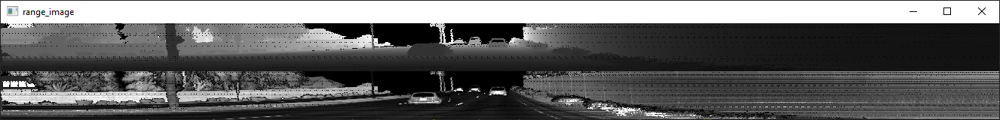

# Writeup: Track 3D-Objects Over Time

To execute this project, please run the `loop_over_dataset.py` script within a Python environment that has all the necessary packages installed.

## Project step 1: Compute Lidar Point-Cloud from Range Image

### Visualize range image channels

My implementation of the function `show_range_image` in file `objdet_pcl.py`

```python
# visualize range image
def show_range_image(frame, lidar_name):

    ####### ID_S1_EX1 START #######     
    #######
    print("student task ID_S1_EX1")

    # step 1 : extract lidar data and range image for the roof-mounted lidar
    lidar                       = [obj for obj in frame.lasers if obj.name == lidar_name][0]

    # step 2 : extract the range and the intensity channel from the range image
    ri                          = dataset_pb2.MatrixFloat()
    ri.ParseFromString(zlib.decompress(lidar.ri_return1.range_image_compressed))
    ri                          = np.array(ri.data).reshape(ri.shape.dims)

    # step 3 : set values <0 to zero
    ri[ri<0]                    = 0.0

    # step 4 : map the range channel onto an 8-bit scale and make sure that the full range of values is appropriately considered
    ri_range                    = ri[:,:,0]
    ri_range                    = ri_range * 255 / (np.amax(ri_range) - np.amin(ri_range)) 
    img_range                   = ri_range.astype(np.uint8)

    # step 5 : map the intensity channel onto an 8-bit scale and normalize with the difference between the 1- and 99-percentile to mitigate the influence of outliers
    ri_intensity                = ri[:,:,1]
    percentile_1, percentile_99 = percentile(ri_intensity,1), percentile(ri_intensity,99)
    ri_intensity                = 255 * np.clip(ri_intensity,percentile_1,percentile_99)/percentile_99 
    img_intensity               = ri_intensity.astype(np.uint8)

    # step 6 : stack the range and intensity image vertically using np.vstack and convert the result to an unsigned 8-bit integer
    img_range_intensity         = np.vstack((img_range,img_intensity))
    img_range_intensity         = img_range_intensity.astype(np.uint8)
    
    # Crop range image to +/- 90 deg. left and right of the forward-facing x-axis
    deg90                       = int(img_range_intensity.shape[1] / 4)
    ri_center                   = int(img_range_intensity.shape[1]/2)
    img_range_intensity         = img_range_intensity[:,ri_center-deg90:ri_center+deg90]

    #######
    ####### ID_S1_EX1 END #######     
    
    return img_range_intensity
```

In order to be able to use this function these modules were added 

```python
from numpy.lib.function_base import percentile
import zlib
```

And the output-image looks like the following:



### Visualize lidar point-cloud 


### 1. Write a short recap of the four tracking steps and what you implemented there (filter, track management, association, camera fusion). Which results did you achieve? Which part of the project was most difficult for you to complete, and why?


### 2. Do you see any benefits in camera-lidar fusion compared to lidar-only tracking (in theory and in your concrete results)? 


### 3. Which challenges will a sensor fusion system face in real-life scenarios? Did you see any of these challenges in the project?


### 4. Can you think of ways to improve your tracking results in the future?

