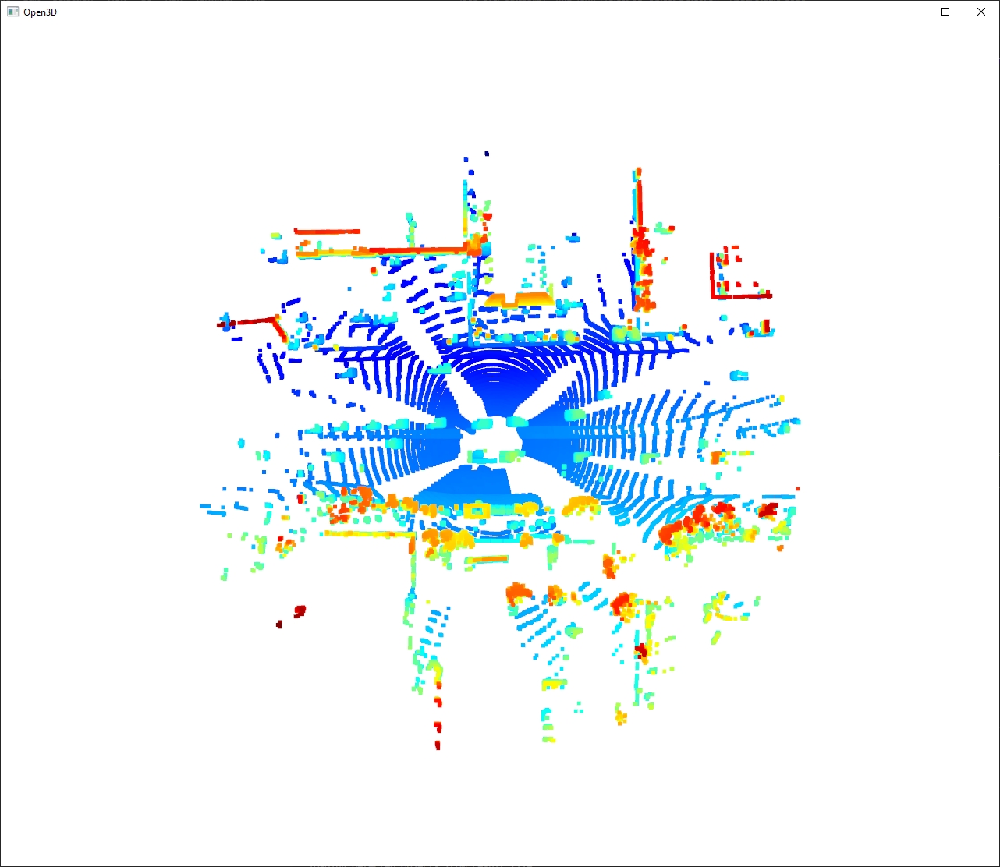
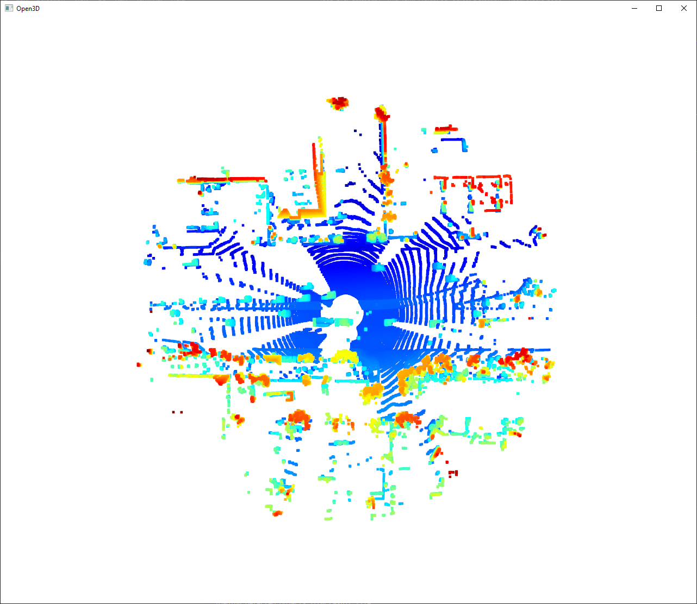

# Writeup: Track 3D-Objects Over Time

To execute this project, please run the `loop_over_dataset.py` script within a Python environment that has all the necessary packages installed.

## 1 Project step 1: Compute Lidar Point-Cloud from Range Image

### 1.1 Visualize range image channels

My implementation of the function `show_range_image` in file `objdet_pcl.py`

```python
# visualize range image
def show_range_image(frame, lidar_name):

    ####### ID_S1_EX1 START #######     
    #######
    print("student task ID_S1_EX1")

    # step 1 : extract lidar data and range image for the roof-mounted lidar
    lidar                       = [obj for obj in frame.lasers if obj.name == lidar_name][0]

    # step 2 : extract the range and the intensity channel from the range image
    ri                          = dataset_pb2.MatrixFloat()
    ri.ParseFromString(zlib.decompress(lidar.ri_return1.range_image_compressed))
    ri                          = np.array(ri.data).reshape(ri.shape.dims)

    # step 3 : set values <0 to zero
    ri[ri<0]                    = 0.0

    # step 4 : map the range channel onto an 8-bit scale and make sure that the full range of values is appropriately considered
    ri_range                    = ri[:,:,0]
    ri_range                    = ri_range * 255 / (np.amax(ri_range) - np.amin(ri_range)) 
    img_range                   = ri_range.astype(np.uint8)

    # step 5 : map the intensity channel onto an 8-bit scale and normalize with the difference between the 1- and 99-percentile to mitigate the influence of outliers
    ri_intensity                = ri[:,:,1]
    percentile_1, percentile_99 = percentile(ri_intensity,1), percentile(ri_intensity,99)
    ri_intensity                = 255 * np.clip(ri_intensity,percentile_1,percentile_99)/percentile_99 
    img_intensity               = ri_intensity.astype(np.uint8)

    # step 6 : stack the range and intensity image vertically using np.vstack and convert the result to an unsigned 8-bit integer
    img_range_intensity         = np.vstack((img_range,img_intensity))
    img_range_intensity         = img_range_intensity.astype(np.uint8)
    
    # Crop range image to +/- 90 deg. left and right of the forward-facing x-axis
    deg90                       = int(img_range_intensity.shape[1] / 4)
    ri_center                   = int(img_range_intensity.shape[1]/2)
    img_range_intensity         = img_range_intensity[:,ri_center-deg90:ri_center+deg90]

    #######
    ####### ID_S1_EX1 END #######     
    
    return img_range_intensity
```

In order to be able to use this function these modules were added 

```python
from numpy.lib.function_base import percentile
import zlib
```

And the output-image looks like the following:


### 1.2 Visualize lidar point-cloud 

My implementation of the function `show_pcl` in file `objdet_pcl.py`

```python
# visualize lidar point-cloud
def show_pcl(pcl):

    ####### ID_S1_EX2 START #######     
    #######
    print("student task ID_S1_EX2")

    # step 1 : initialize open3d with key callback and create window
    vis_lpc     = o3d.visualization.VisualizerWithKeyCallback()
    vis_lpc.create_window(window_name='Open3D', width=1280, height=1080, left=50, top=50, visible=True)
    global idx
    idx= True
    def right_click(vis_lpc):
        global idx
        print('right arrow pressed')
        idx     = False
        return
    vis_lpc.register_key_callback(262,right_click)

    # step 2 : create instance of open3d point-cloud class
    pcd         = o3d.geometry.PointCloud()

    # step 3 : set points in pcd instance by converting the point-cloud into 3d vectors (using open3d function Vector3dVector)
    pcd.points  = o3d.utility.Vector3dVector(pcl[:,:3])

    # step 4 : for the first frame, add the pcd instance to visualization using add_geometry; for all other frames, use update_geometry instead
    vis_lpc.add_geometry(pcd)

    # step 5 : visualize point cloud and keep window open until right-arrow is pressed (key-code 262)
    while idx:
        vis_lpc.poll_events()
        vis_lpc.update_renderer()

    #######
    ####### ID_S1_EX2 END ####### 
```

In order to be able to use this function this module was included

```python
import open3d as o3d
```

And the output-image of the lidar point-cloud looks like the following:

<table>
  <tr>
    <td>
      
    </td>
    <td>
      
    </td>
  </tr>
  <tr>
    <td>
      
    </td>
    <td>
      
    </td>
  </tr>
</table>

## 2 Project step 2: Create Birds-Eye View from Lidar PCL

### 2.1 Convert sensor coordinates to BEV-map coordinates

My implementation of first part of the function `bev_from_pcl` in file `objdet_pcl.py`

```python
    # convert sensor coordinates to bev-map coordinates (center is bottom-middle)
    ####### ID_S2_EX1 START #######     
    #######
    print("student task ID_S2_EX1")

    ## step 1 :  compute bev-map discretization by dividing x-range by the bev-image height (see configs)
    bev_discret         = (configs.lim_x[1] - configs.lim_x[0]) / configs.bev_height

    ## step 2 : create a copy of the lidar pcl and transform all metrix x-coordinates into bev-image coordinates    
    lidar_pcl_cpy       = np.copy(lidar_pcl)
    lidar_pcl_cpy[:, 0] = np.int_(np.floor(lidar_pcl_cpy[:, 0] / bev_discret))

    # step 3 : perform the same operation as in step 2 for the y-coordinates but make sure that no negative bev-coordinates occur
    lidar_pcl_cpy[:, 1] = np.int_(np.floor(lidar_pcl_cpy[:, 1] / bev_discret) + (configs.bev_width + 1) / 2)
    lidar_pcl_cpy[:, 1] = np.abs(lidar_pcl_cpy[:,1])

    # step 4 : visualize point-cloud using the function show_pcl from a previous task
    show_pcl(lidar_pcl_cpy)

    #######
    ####### ID_S2_EX1 END ####### 
```
And the output-image of the BEV looks like the following:


### 2.2 Compute intensity layer of the BEV map

# Compute intensity layer of the BEV map

My implementation of second part of the function `bev_from_pcl` in file `objdet_pcl.py`

```python
    ####### ID_S2_EX2 START #######     
    #######
    print("student task ID_S2_EX2")

    ## step 1 : create a numpy array filled with zeros which has the same dimensions as the BEV map
    intensity_map                           = np.zeros((configs.bev_height, configs.bev_width))

    # step 2 : re-arrange elements in lidar_pcl_cpy by sorting first by x, then y, then -z (use numpy.lexsort)
    lidar_pcl_cpy[lidar_pcl_cpy[:,3]>1.0,3] = 1.0
    idx_intensity                           = np.lexsort((-lidar_pcl_cpy[:, 2], lidar_pcl_cpy[:, 1], lidar_pcl_cpy[:, 0]))
    lidar_pcl_top                           = lidar_pcl_cpy[idx_intensity]

    ## step 3 : extract all points with identical x and y such that only the top-most z-coordinate is kept (use numpy.unique)
    ##          also, store the number of points per x,y-cell in a variable named "counts" for use in the next task
    lidar_pcl_int, indices, count           = np.unique(lidar_pcl_cpy[:, 0:2], axis=0, return_index=True, return_counts=True)
    lidar_pcl_top                           = lidar_pcl_cpy[indices]

    ## step 4 : assign the intensity value of each unique entry in lidar_top_pcl to the intensity map 
    ##          make sure that the intensity is scaled in such a way that objects of interest (e.g. vehicles) are clearly visible    
    ##          also, make sure that the influence of outliers is mitigated by normalizing intensity on the difference between the max. and min. value within the point cloud
    intensity_map[np.int_(lidar_pcl_top[:, 0]), 
            np.int_(lidar_pcl_top[:, 1])]   = lidar_pcl_top[:, 3] / (np.amax(lidar_pcl_top[:, 3])-np.amin(lidar_pcl_top[:, 3]))
    
    ## step 5 : temporarily visualize the intensity map using OpenCV to make sure that vehicles separate well from the background
    img_intensity                           = intensity_map * 256
    img_intensity                           = img_intensity.astype(np.uint8)
    cv2.imshow('img_intensity', img_intensity)
    cv2.waitKey(0)
    cv2.destroyAllWindows()

    #######
    ####### ID_S2_EX2 END ####### 
```
And the output-image of the corresponding intensity channel looks like the following:


### 2.3 Compute height layer of the BEV map


### 1. Write a short recap of the four tracking steps and what you implemented there (filter, track management, association, camera fusion). Which results did you achieve? Which part of the project was most difficult for you to complete, and why?


### 2. Do you see any benefits in camera-lidar fusion compared to lidar-only tracking (in theory and in your concrete results)? 


### 3. Which challenges will a sensor fusion system face in real-life scenarios? Did you see any of these challenges in the project?


### 4. Can you think of ways to improve your tracking results in the future?

